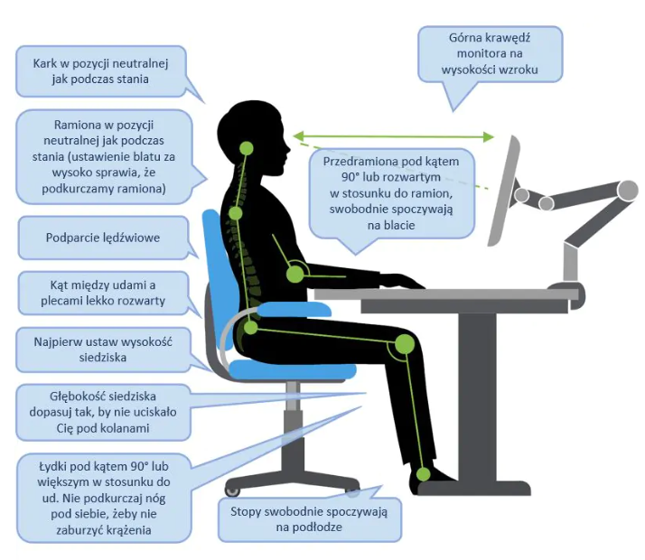

=============================================
Ergonomia Miejsca Pracy Przed Komputerem
=============================================

Dostosowanie stanowiska pracy do zasad ergonomii może znacząco poprawić komfort i zdrowie podczas pracy przed komputerem. Oto kilka kluczowych zasad:

+----------------------------------+----------------------------------------------------------------+-------------------------------------------------+
| **Wysokość Monitora:**           | Ustaw monitor na wysokości oczu, aby uniknąć nadmiernego nachylania głowy w górę lub w dół.                      |
+----------------------------------+----------------------------------------------------------------+-------------------------------------------------+
| **Odpowiednia Odległość:**       | Utrzymuj odległość monitora na poziomie długości ramienia, aby uniknąć zbyt bliskiego kontaktu                   |
+----------------------------------+----------------------------------------------------------------+-------------------------------------------------+
| **Wysokość Krzesła:**            | Krzesło powinno być dostosowane do wysokości biurka, pozwalając na wygodne ustawienie nóg i stóp na podłodze.    |
+----------------------------------+----------------------------------------------------------------+-------------------------------------------------+
| **Prawidłowa Postawa:**          | Zachowaj naturalną postawę ciała, trzymając plecy prosto i podpierając lędźwie.                                  |
+----------------------------------+----------------------------------------------------------------+-------------------------------------------------+
| **Podłokietniki:**               | Używaj podłokietników, aby wspomóc przedramiona, utrzymując je w pozycji równoległej do podłogi.                 |
+----------------------------------+----------------------------------------------------------------+-------------------------------------------------+
| **Klawiatura i Mysz:**           | Używaj klawiatury i myszy, które pozwalają na naturalny chwyt i minimalizują napięcie w nadgarstkach.            |
+----------------------------------+----------------------------------------------------------------+-------------------------------------------------+

Prawidłowa pozycja siedząca: 
----------------------------------

    Staraj się utrzymywać pozycję jak w powyższym zdjęciu.
